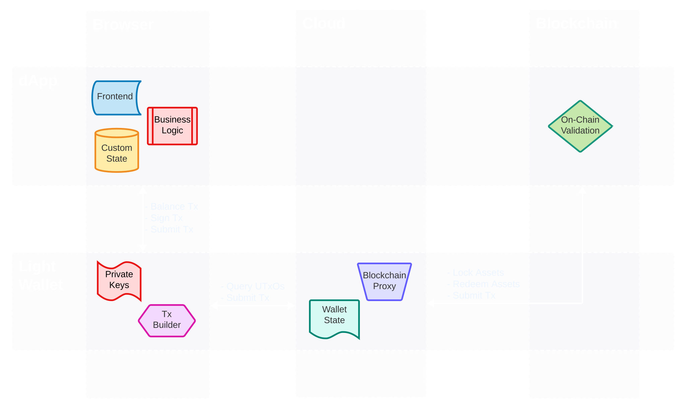

## Introduction
This document _attempts_ to identify and describe architectural patterns beign used for desigining dApps. It focuses on the _topology_ of the systems, as being considered the most relevant aspect of a dApp's architecture. 

The examples identified in this document don't pretend to be an exhasutive list of every posible topology, they represent common _patterns_.

### dApp
_dApp_ is a loaded term. In the context of this document, we'll define the term "dApp" as any distributed software system that incorporates one or many of the following charasteristics:

- censorship resistant: meaning that no single entity or organization can arbitrary limit the access of certain users to the system.
- self-accountability: meaning that users can autonomosuly verify the correctnes of their interactions with the system, usually by means of cryptography and distributed consensus algorithms.
- resiliance: meaning that the system is resistant to outages and other disruptions, not only at the technological level, but in particular at the _organizational_ level.

### System Topology
In software architecture, a topology refers to the layout or arrangement of components in a system. It describes how these components are connected and how they communicate with each other. A topology can be thought of as a map or diagram that shows the relationships between different components in a system.

### Architectural Patterns
An architectural pattern is a general, reusable solution to a commonly occurring problem in software architecture within a given context. Architectural patterns are similar to software design patterns, but they are higher level and deal with the overall structure of the software system.

### Components
To describe a topology patterns, we need to define the components involved in the system. We identify the following classes of components in a dApp:

- **Frontend**: This component represents the UI that allows the end-user to interact with the system. There's no techonological constraint, it could be a web-based app, a mobile app, a CLI, etc.
- **Busines Logic**: This component represents the rules and processes that govern the operations of the domain. It represents the core functionality of the system and is typically implemented in the form of algorithms and rules that define how the application should behave in different scenarios.
- **Custom State**: This component represents any domain-specific data of the system required to perform the operations defined by the business logic or frontend interactions. It usually provides some level of persistence across user sessions.
- **Wallet State**: This component holds a representation of any self-custodial assets that the end-user can utilize as part of transactions involved in the interactions with the system. In a UTxO-based blockchain, it would represent the set of available UTxOs controlled by the user.
- **Tx Builder**: This component represent the rules and processes that govern how transactions of self-custodial assets are defined in order to fullfil a particular interaction with the system by using the wallet state of the end-user. In a UTxO-based blockchain, this would be the coin-selection / balancing algorithm.
- **On-Chain Validator**: This component represents the rules and proceses that govern domain-specific validations of transactions that occur as part of the cryptographically-secure consensus algorithm. Usually loosely refered to as "smart contract".
- **Blockchain Proxy**: This component represents an application programing interface (API) that serves as gateway between the system and any blockchain-related operations. At its minimum, it should include a mechanism to submit transactions and a mechanism to query on-chain data.

### Runtime Environment
A dApp involves a certain level of _distribution_ of its constituent components accross different locations. We define each location as a _runtime environment_. We identify the following classes of common _runtime environments_:

- **End-user Device**: An execution environment managed directly by the end-user which holds a high-degree of confidence that data and processes are handled in a secure and private fashion. Common examples are: a browser session, a desktop application, a mobile application, etc.
- **Cloud**: An execution enviornment that runs on servers accesible through a public network which are managed by a party different than the end-user. These are usually servers hosted in cloud providers such as AWS, Azure, GCP, etc and usually managed by the team in charge of the development of the system.
- **Blockchain**: An execution environment that runs on nodes participating in a distributed consensus algorithm. These are usually servers in a P2P topology that are managed by diverse parties. The degree of security and privacy of this environment is defined by the protocols and cryptographic algorithms in charge of the consensus.

## Toplogies

Instead of having very long names or cryptic acronyms for each topology, we're going to give them an (arbitrary?) name inspired by pizza toppings (**top**ings ~ **top**ology).

### Pepperoni

This topology describes an hibrid end-user app. Users interact with a frontend running on their device. The bulk of the business logic executes server-side. It leverages features in the user's light-wallet as a gateway to the blockchain. It relies on on-chain validators for security.

### Proshiuto

WIP

### Hawaiian

WIP

### Mushrooms

WIP

### Anchovy

WIP

