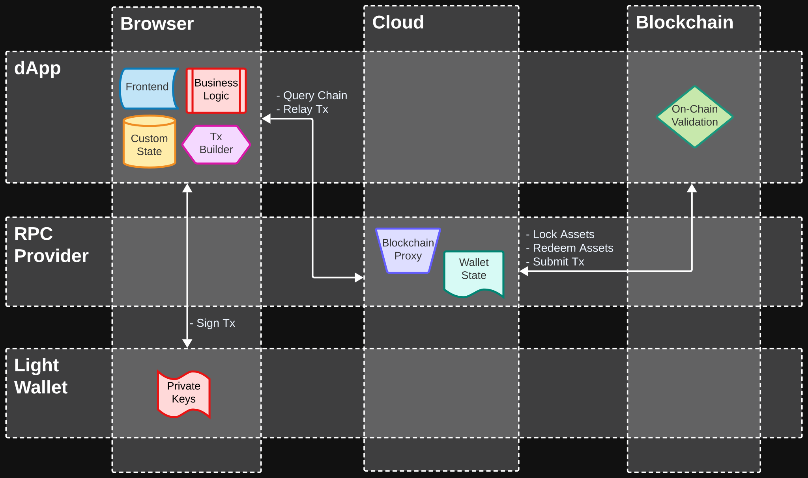
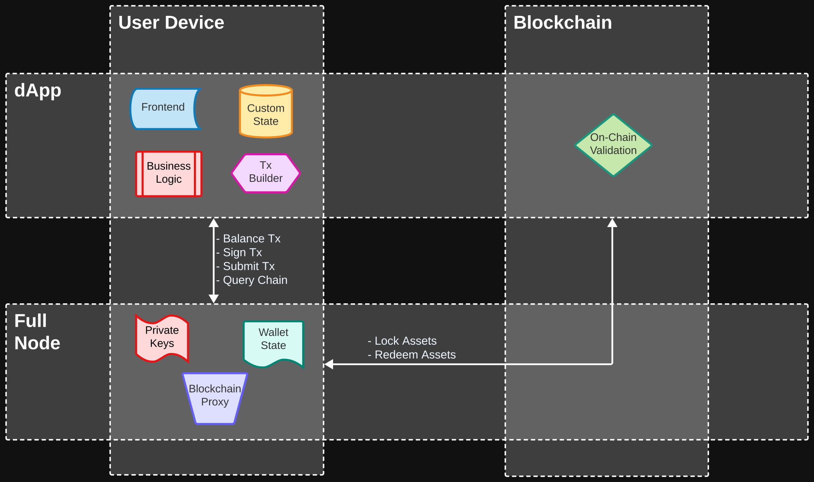

import { Callout } from "nextra-theme-docs";

## Introduction

_dApp_ is a loaded term. This RFC _attempts_ to disambiguate the concept by describing its constituent components and connections. We do so by identifying common patterns across different architectures.

### Decentralized Apps

In the context of this document, we'll assume the term "dApp" describes any distributed software system that incorporates one or many of the following characteristics:

- **censorship resistant**: meaning that no single entity or organization can arbitrary limit the access of certain users to the system.
- **self-accountability**: meaning that users can autonomously verify the correctness of their interactions with the system, usually by means of cryptography and distributed consensus algorithms.
- **resilience**: meaning that the system is resistant to outages and other disruptions, not only at the technological level, but in particular at the _organizational_ level.

This definition forces us to think of the concept "decentralized" as a non-binary quality that can be applied independently to different components of the same dApp.

For example, in the context of a DEX, the on-chain component controlling the swaps is censorship-resistant, but at the same time, its frontend component might be managed by a single central entity. This describes a dApp with different levels of decentralization for its constituent components.

### System Topology

In software architecture, a topology refers to the layout or arrangement of components in a system. It describes how these components are connected and how they communicate with each other. A topology can be thought of as a map or diagram that shows the relationships between different components in a system.

To describe the topology of a dApp, we need to define classes of components involved in the system. We identify the following classes for the purpose of this document:

- **Frontend**: This component represents the UI that allows the end-user to interact with the system. There's no technological constraint, it could be a web-based app, a mobile app, a CLI, etc.
- **Business Logic**: This component represents the rules and processes that govern the operations of the domain. It represents the core functionality of the system and is typically implemented in the form of algorithms and rules that define how the application should behave in different scenarios.
- **Custom State**: This component represents any domain-specific data of the system required to perform the operations defined by the business logic or frontend interactions. It usually provides some level of persistence across user sessions.
- **Wallet State**: This component holds a representation of any self-custodial assets that the end-user can utilize as part of transactions involved in the interactions with the system. In a UTxO-based blockchain, it would represent the set of available UTxOs controlled by the user.
- **Tx Builder**: This component represent the rules and processes that govern how transactions of self-custodial assets are defined in order to fullfil a particular interaction with the system by using the wallet state of the end-user. In a UTxO-based blockchain, this would be the coin-selection / balancing algorithm.
- **Private Keys**: The cryptographic keys that allows the holder to sign transactions on behalf of a particular identity.
- **On-Chain Validator**: This component represents the rules and processes that govern domain-specific validations of transactions that occur as part of the cryptographically-secure consensus algorithm. Usually loosely referred to as "smart contract".
- **Blockchain Proxy**: This component represents an application programing interface (API) that serves as gateway between the system and any blockchain-related operations. At its minimum, it should include a mechanism to submit transactions and a mechanism to query on-chain data.

### Runtime Environment

A dApp involves a certain level of _distribution_ of its constituent components across different physical locations. We define each location as a _runtime environment_. We identify the following classes of common _runtime environments_:

- **End-user Device**: An execution environment managed directly by the end-user which holds a high-degree of confidence that data and processes are handled in a secure and private fashion. Common examples are: a browser session, a desktop application, a mobile application, etc.
- **Cloud**: An execution environment that runs on servers accessible through a public network which are managed by a party different than the end-user. These are usually servers hosted in cloud providers such as AWS, Azure, GCP, etc and usually managed by the team in charge of the development of the system.
- **Blockchain**: An execution environment that runs on nodes participating in a distributed consensus algorithm. These are usually servers in a P2P topology that are managed by diverse parties. The degree of security and privacy of this environment is defined by the protocols and cryptographic algorithms in charge of the consensus.

## Topologies

An architectural pattern is a general, reusable solution to a commonly occurring problem in software architecture within a given context. Architectural patterns are similar to software design patterns, but they are higher level and deal with the overall structure of the software system.

In this section we describe different patterns of the topologies that we manage to identify. It doesn't pretend to be an exhaustive list of every possible dApp architecture, but rather a high-level abstraction that provides a common taxonomy that we, as developers, can use to exchange ideas.

<Callout>
  Instead of having very long names or cryptic acronyms for each topology, we're
  going give each topology an (arbitrary?) name inspired by pizza toppings
  (**top**pings ~ **top**ology).
</Callout>

### Pepperoni

This topology describes an end-user app where the bulk of the business logic resides on the server-side. Users interact with a frontend running on their device. The user's light wallet is leveraged for signing transactions. The server-side acts as a gateway to the blockchain. It relies on on-chain validators for security.

### Prosciutto

This topology describes an end-user app where all of the business logic resides client-side. Users interact with a frontend and business logic running on their device. The user's light wallet is leveraged for signing transactions, accessing the wallet state and submitting transaction. There's no server-side involved.

### Hawaiian

This topology is similar to _Prosciutto_, in the sense that all of the business logic resides client-side. The main difference relies in that there's a generic RPC provider for querying blockchain data and submitting transactions.

### Mushrooms

This topology is referred to as a "headless app". The bulk of the business and state resides server-side, where access to the features are exposed through an API. 3rd parties, different from the dApp provider, can build independent frontends or provide new functionality by composing APIs.

### Anchovy

This is the most centralized topology of the list. All of the business logic, state, frontend and even the private keys reside on a central server-side environment. This is how CEX works. The decentralization resides on the fact that transactions are finally submitted to the blockchain where they can be audited.

### Bacon

This topology aims at full self-accountability by running not only the frontend and business logic client-side, but also by having a full-node running on the client device. Users interactions are ran locally and transactions are submitted to the local blockchain node, which performs all the corresponding cryptographic validations.

## Future Work

The current state of the document only scratches the surface of the diversity of technologies and topologies in use. In future iterations of this RFC, we'll incorporate descriptions of more elaborated (more gourmet?) alternatives. The following list represents a broad list of topics to explore:

- [ ] Describe _grid-computing infrastructure_ as potential replacement for traditional web2 cloud providers.
- [ ] Describe distributed storage solutions, such as IPFS, and their role in existing dApp topologies.
